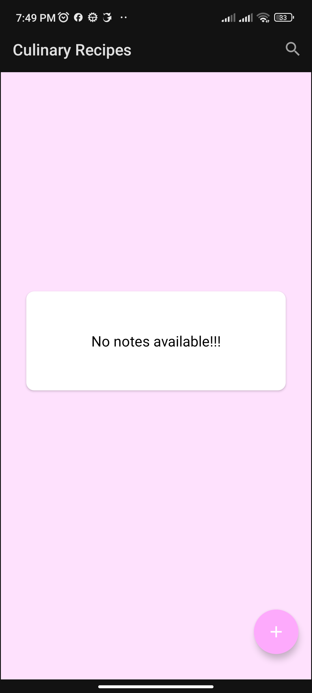
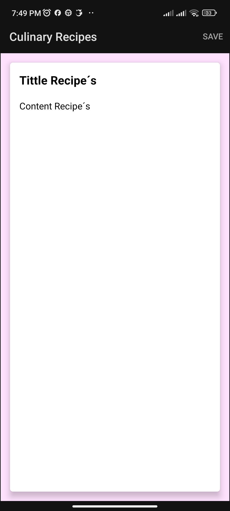

# Culinary Recipes
Crea, guarda, modifica, comparte y elimina tus recetas de cocina en un solo lugar. Esta app permite organiza tus recetas curinarias. 

## 📌 Tareas Pendientes
- Fix Bug: MenuBar no se muestra. 

## 🎯 Objetivo del proyecto
- Guardar, crear y modificar recetas curinarias
- Compartir recetas.
- Sea offline (ROOM Database)
- Arquitectura MVVM
- Lenguaje Kotlin
- Sea fácil de mantener y extender

## 🚀 Características
- Interfaz de usuario limpia e intuitiva.
- Desarrollada con Kotlin.
- ROOM Database
- Sigue las mejores prácticas de Android.

## 🛠️ Tecnología utilizada
- Android SDK
- Kotlin
- Gradle
- ROOM Database
- Arquitectura MVVM
- Live Data
- Data Binding
- CardView
- View Models
- Search View
- Safe Args
- Navigation Components

## 📌 Mejoras futuras
- Animación al iniciar la app.
- Sustituir ROOM por Firebase Databse.

## 📱 Screenshots

  
  

## 🎥 Demo

  

## 👤 Autor
Adrián Hernández López / 
Desarrollador Android
